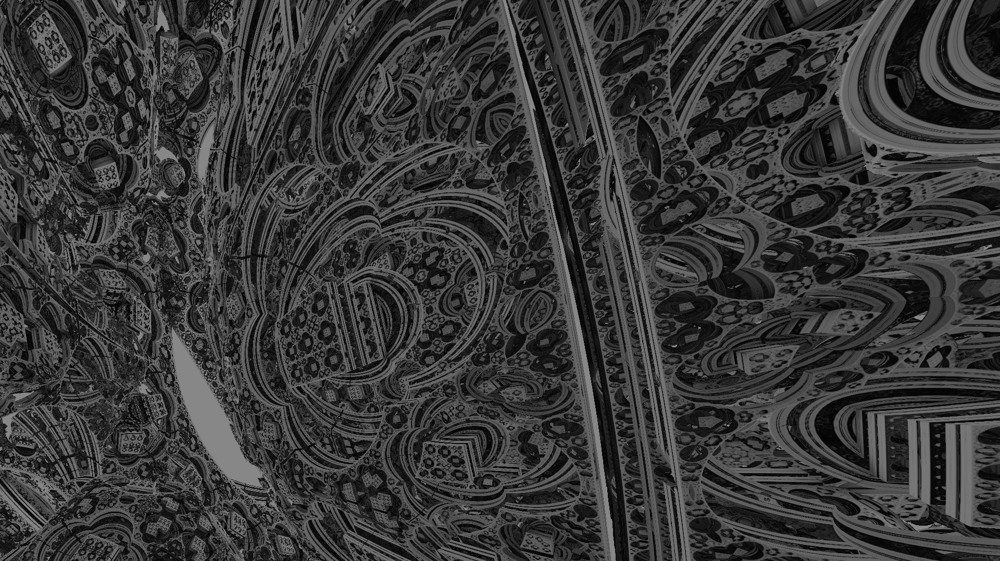

# Table of Contents
* [Introduction](#intro)
* [Build](#build)
* [Usage](#usage)

## Introduction 
This project draw a figure called "Mandelbox" using OpenGL 4.6. Also I wrote some functions to simplify the work with OpenGL and debugging, I will tell more in [Usage](#usage) section. You can read about Mandelbox figure [here](http://blog.hvidtfeldts.net/index.php/2011/11/distance-estimated-3d-fractals-vi-the-mandelbox/).  
Some screenshot of this figure, that my program draw.   

You can see some another examples of this figure here [shadertoy](https://www.shadertoy.com).

## Build 
This project was builded in my own system (Arch Linux 5.18.2-arch1-1). I do not test any other systems.  
For build do following:
~~~bash
git clone https://github.com/krisszzzz/Mandelbox
mkdir build
cd build
cmake ..
~~~
This will create an executable file (named "Mandelbox").

## Usage 
You can see the examples of usage in the [documentation](https://github.com/krisszzzz/Mandelbox/blob/master/doc.pdf). 
Also you can see [GLFW](https://github.com/krisszzzz/Mandelbox/blob/master/gflw_doc.pdf) documentation. GLAD is not provide doxygen documentation (at least in
my version of this library).
